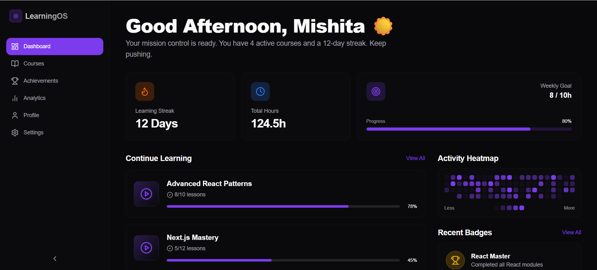
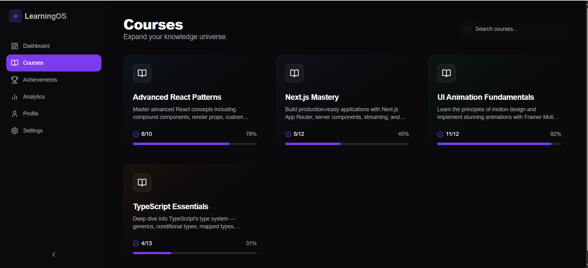
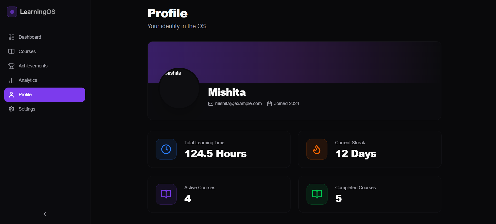

# Student Learning Dashboard

A modern and futuristic Student Learning Dashboard built with **Next.js 15**, **TypeScript**, **Tailwind CSS**, **Framer Motion**, and **Supabase**. The application provides an interactive learning experience with animated dashboards, course tracking, achievements, analytics, and responsive navigation.

## 🌐 Live Demo

[](https://student-dashboard-project-xsjh.vercel.app/)

---

## Features

* Modern dark-themed UI
* Fully responsive design
* Built with Next.js App Router
* Smooth animations using Framer Motion
* Course management dashboard
* Achievements tracking section
* Analytics and progress visualization
* User profile section
* Settings page
* Course search functionality
* Animated progress indicators
* Bento-grid inspired dashboard layout

---

## Tech Stack

* Next.js 15
* TypeScript
* Tailwind CSS
* Framer Motion
* Recharts
* Lucide React Icons
* Supabase

---

## 📸 Screenshots

### Dashboard



### Courses



### Achievements


### Analytics


### Profile



---

## Project Structure

```bash
app/
components/
├── animations/
├── dashboard/
├── layout/
└── ui/
constants/
hooks/
lib/
public/
services/
types/
```

---

## Installation

Clone the repository:

```bash
git clone https://github.com/mishita27twr/Student-Dashboard-Project.git
```

Navigate to the project folder:

```bash
cd Student-Dashboard-Project
```

Install dependencies:

```bash
npm install
```

Run locally:

```bash
npm run dev
```

Open:

```bash
http://localhost:3000
```

---

## Environment Variables

Create a `.env.local` file:

```env
NEXT_PUBLIC_SUPABASE_URL=
NEXT_PUBLIC_SUPABASE_ANON_KEY=
```

---

## Challenges Faced

* Migrating the project from Vite to Next.js App Router.
* Fixing TypeScript and Framer Motion variant type issues.
* Creating responsive layouts for desktop, tablet, and mobile devices.
* Optimizing animations while avoiding layout shifts.
* Structuring reusable and scalable components.

---

## Future Enhancements

* User authentication
* Real-time learning updates
* Certificate generation
* Personalized recommendations
* Course enrollment system
* Notification center

---

## Author

**Mishita Tiwari**

GitHub: https://github.com/mishita27twr

LinkedIn: https://www.linkedin.com/in/mishita-tiwari-927ba5234/

---

## Support

If you found this project helpful, consider giving it a star on GitHub.
